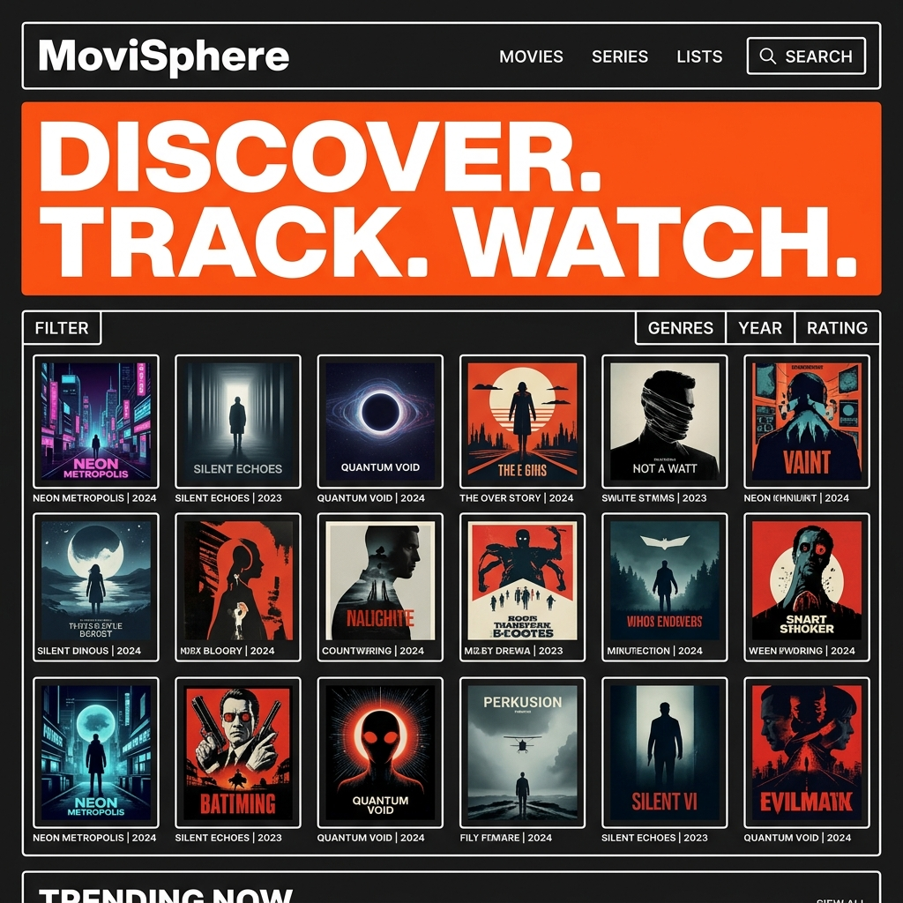
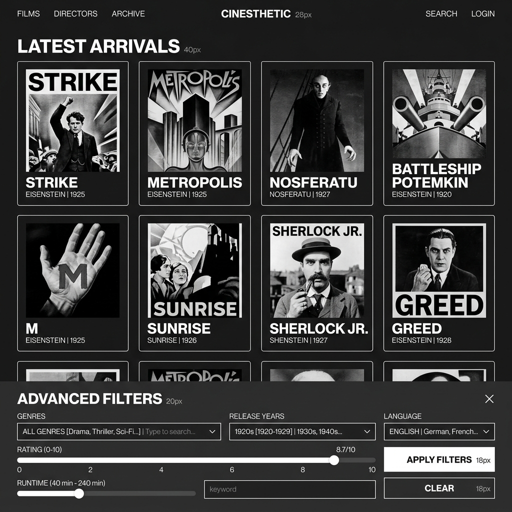
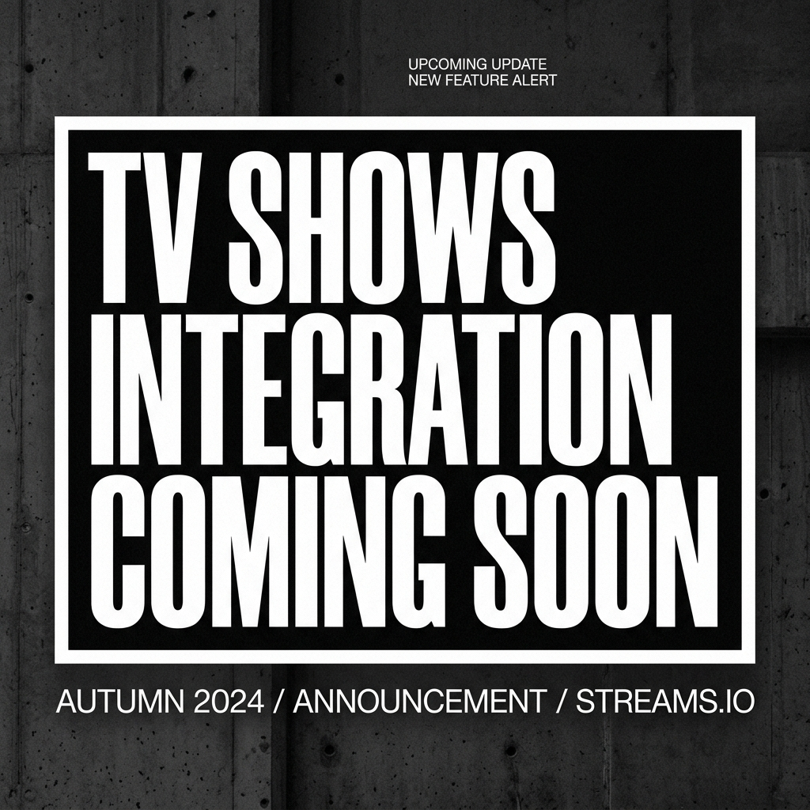
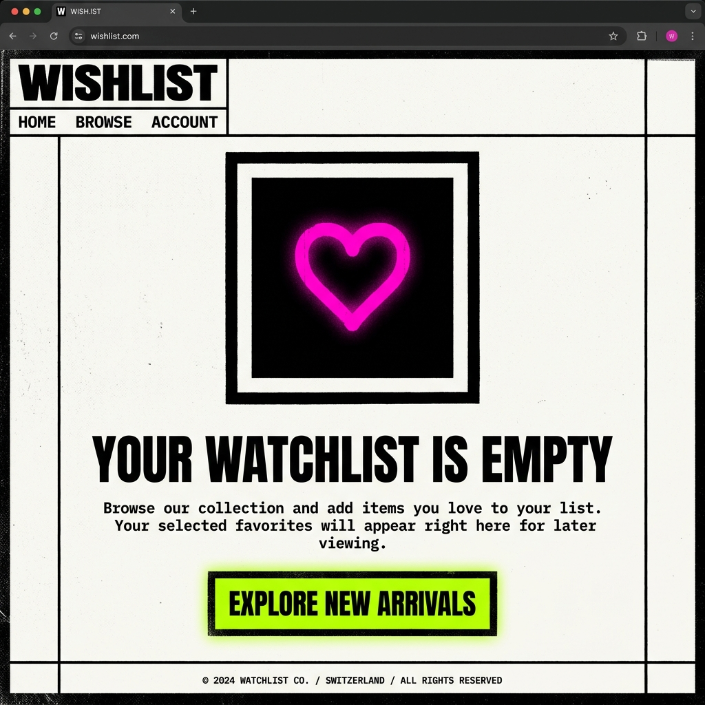

# MoviSphere — Industrial Cyber-Pulp Edition

**MoviSphere** is a bold, editorial-grade digital movie discovery and tracking experience. Rejecting standard streaming layouts, the platform completely reimagines modern information architecture through a high-impact **Neo-Brutalist / Swiss Graphic Design** aesthetic. 

Built with React and powered by TMDB API integration (with local mock fallbacks), MoviSphere features rigid grid layouts, absolute sharp edges, paper-concrete textures, and heavy typography.

---

## 🚀 Tech Stack

- **Core Framework**: React 19 (Functional Components, Hooks, Context API)
- **Bundler & Dev Server**: Vite (Fast HMR, Rolldown)
- **Styling**: Pure Vanilla CSS (custom themes, step-based mechanical transitions, variable-based theme engine)
- **Iconography**: Lucide React
- **API Integration**: TMDB (The Movie Database) REST API with custom fetch handler & offline mock data fallbacks

---

## ✨ Key Features

- **Cyber-Pulp & Swiss Aesthetic**: Rigid 2px white borders on dark backgrounds, zero rounded corners (`border-radius: 0`), and dynamic concrete noise grain overlays.
- **Dynamic Accent Color Schemes**: Real-time theme switching on the fly:
  - **Cyber-Pulp** (Default): Safety Orange highlights & Toxic Cyan tags.
  - **Retro-Swiss**: Neon Fuchsia highlights & Yves Klein Cobalt Blue tags.
  - **Toxic Terminal**: Acid Lime highlights & Toxic Cyan tags.
  - **Monochrome**: High-contrast Pure White & Black plates.
- **Advanced Preference Customization**:
  - **Concrete Opacity Slider**: Adjusts visual noise overlay density (`0%` to `20%`) by modifying `--noise-opacity` CSS variables dynamically.
  - **Visual Theme toggles**: Light Brutalist vs Dark Cyber-Pulp base theme.
  - **Watch Region Selectors**: Localizes trending databases (GLOBAL, US, IN, UK).
  - **Wishlist Wipes**: Instantly resets the saved wishlist database.
- **Grayscale-to-Color Card Hovers**: Snippy mechanical transitions that swap card images from black-and-white to full color, outline borders in brand accents, and slide a thick, offset drop shadow behind containers.
- **Fixed Filters Drawer**: A sticky bottom filter drawer accessible from any view allowing multi-filter intersections (genres, release year, minimum rating scores).
- **Comprehensive Movie Details**:
  - Blurred movie backdrop headers.
  - Interactive **YouTube Trailer** player.
  - Localized **Streaming Watch Providers (OTT)** indicators.
  - Cast biography modal popup panels.
  - Direct recommendations grid ("People Also Liked").

---

## 📸 Visual Interface Gallery

### 1. Editorial Homepage & Trending Grids


---

### 2. Explore Archive & Advanced Multi-Filter Drawer


---

### 3. TV Shows V2 Announcement Billboard


---

### 4. Wishlist Empty State Screen


---

## 📂 Project Directory Structure

```
├── .env.example              # Template for API credentials
├── .gitignore                # Excludes node_modules and private .env files
├── eslint.config.js          # Linter configuration
├── index.html                # Main HTML entrypoint
├── package.json              # Script definitions and project dependencies
├── public/                   # Static resources
│   ├── favicon.svg           # Custom brutalist page favicon
│   └── icons.svg             # Page asset symbols
├── src/                      # Source Code
│   ├── main.jsx              # React mounting root
│   ├── App.jsx               # Router dispatcher and layout shell
│   ├── index.css             # Unified CSS tokens, typography, and themes
│   ├── assets/               # Brand logo files and background placeholders
│   ├── context/
│   │   └── MovieContext.jsx  # Global state manager (routing, wishlist, filters, accents)
│   ├── services/
│   │   ├── tmdb.js           # API fetch logic and fallback client
│   │   └── mockData.js       # Complete offline datasets (movies, reviews, watch providers)
│   ├── components/
│   │   ├── Backdrop.jsx      # Detail page header visual
│   │   ├── CastList.jsx      # Billed cast profiles list and biography popup modals
│   │   ├── FilterBar.jsx     # Selectors for advanced query filters
│   │   ├── LeftRail.jsx      # Left sidebar navigation links and drawer controls
│   │   ├── MovieCard.jsx     # Core grid card featuring rank indices and hover outlines
│   │   ├── Sidebar.jsx       # Detail view player wrapper and streaming availability slots
│   │   └── TopBar.jsx        # Top global search bar and wishlist buttons
│   └── views/
│       ├── HomeView.jsx      # Homepage rendering trending feeds and hero slides
│       ├── MovieDetailView.jsx# Detailed review summaries, recommendations, and bios
│       ├── WishlistView.jsx  # wishlist view page with customized empty illustrations
│       ├── TvShowsView.jsx   # Teaser billboard for upcoming Version 2 features
│       └── SettingsView.jsx  # Custom dashboard panel for live configurations
└── vite.config.js            # Bundler configurations
```

---

## ⚙️ Setup & Installation

### 1. Clone the repository
```bash
git clone https://github.com/Karthikeyan-Jagadesh/Modern-Movie-Application.git
cd Modern-Movie-Application
```

### 2. Install dependencies
```bash
npm install
```

### 3. Add API credentials
Create a `.env` file in the root directory and add your TMDB API Key:
```env
VITE_TMDB_API_KEY=your_tmdb_api_key_here
```
*If no API key is provided, the application will automatically enter **Mock Mode** using the extensive datasets in `mockData.js` to ensure the application remains fully functional.*

### 4. Run the development server
```bash
npm run dev
```

### 5. Compile for production
```bash
npm run build
```
The optimized production bundle will be created inside the `dist/` directory.
