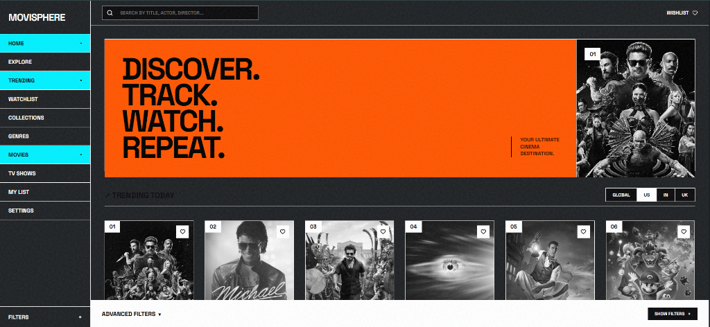
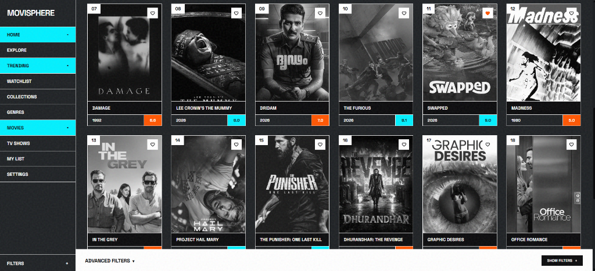
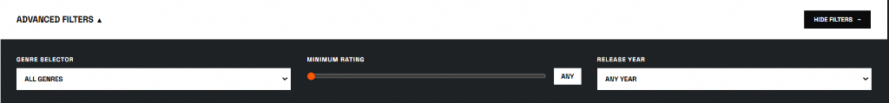
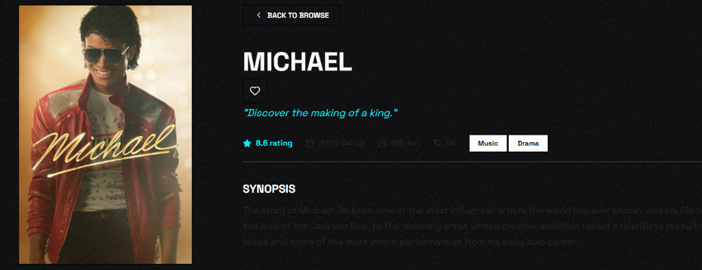
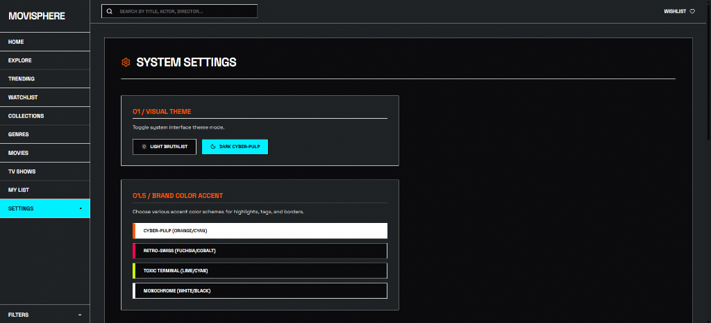
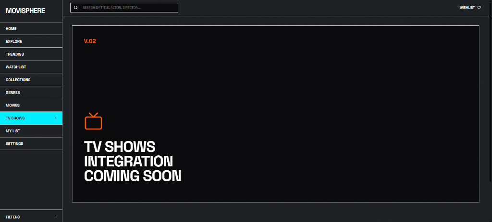
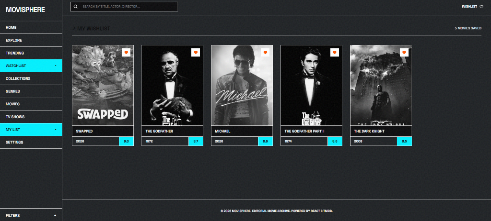

# MoviSphere | An Movie Discovery Experience
A React + Vite web application that reimagines movie browsing ,
explore trending titles, switch between bold accent themes, and
track films to a wishlist.

---
## system.identity
~~~
name        : movisphere
type        : front-end web application
architecture: component-based (React + Context API)
runtime     : Node.js 18+
status      : active
version     : 1.0.0
~~~
---
## system.overview
~~~
MoviSphere solves a simple problem — bland, generic
streaming layouts. Users browse trending and recommended
films through a high-impact Neo-Brutalist interface, swap
between four accent color schemes, filter by genre, year,
and rating, and save favorites to a wishlist. Built on the
TMDB API with a complete offline mock-data fallback.
~~~
---
## system.visuals
~~~
### homepage (upper section)

---
### homepage (lower section)

---
### homepage trending feed

---
### advanced multi-filter drawer

---
### movie details page

---
### settings page

---
### tv shows page

---
### wishlist page

~~~
---
## modules
### theme.module
~~~
- four dynamic accent color schemes: Cyber-Pulp, Retro-Swiss, Toxic Terminal, Monochrome
- light brutalist vs dark cyber-pulp base theme toggle
- concrete noise opacity slider (0% to 20%) via CSS variables
~~~
### discovery.module
~~~
- trending feed and hero slides on the homepage
- grayscale-to-color card hover transitions with offset shadows
- sticky bottom filters drawer (genre, release year, minimum rating)
- watch region selector (GLOBAL, US, IN, UK)
~~~
### detail.module
~~~
- blurred movie backdrop headers
- interactive YouTube trailer player
- localized streaming watch provider (OTT) indicators
- cast biography modal popups
- "people also liked" recommendations grid
~~~
### wishlist.module
~~~
- add or remove movies from a personal wishlist
- dedicated wishlist view with custom empty-state illustration
- one-click wishlist wipe
~~~
### data.module
~~~
- TMDB REST API integration via a custom fetch handler
- automatic mock mode using offline datasets when no API key is set
- complete fallback datasets for movies, reviews, and watch providers
~~~
---
## tech.stack
~~~
core        : React 19 (Functional Components, Hooks, Context API)
bundler     : Vite (Fast HMR, Rolldown)
styling     : Vanilla CSS (variable-based theme engine)
icons       : Lucide React
api         : TMDB (The Movie Database) REST API
~~~
---
## project.structure
~~~
src/
├── main.jsx                  
├── App.jsx                    
├── index.css                   
├── assets/                     
├── context/
│   └── MovieContext.jsx         
├── services/
│   ├── tmdb.js                   
│   └── mockData.js                
├── components/
│   ├── Backdrop.jsx
│   ├── CastList.jsx
│   ├── FilterBar.jsx
│   ├── LeftRail.jsx
│   ├── MovieCard.jsx
│   ├── Sidebar.jsx
│   └── TopBar.jsx
└── views/
    ├── HomeView.jsx
    ├── MovieDetailView.jsx
    ├── WishlistView.jsx
    ├── TvShowsView.jsx
    └── SettingsView.jsx
~~~
---
## execution
~~~
git clone https://github.com/Karthikeyan-Jagadesh/Modern-Movie-Application.git
cd Modern-Movie-Application
npm install
~~~
~~~
create a .env file in the root directory:
VITE_TMDB_API_KEY=your_tmdb_api_key_here
(no key? the app auto-switches to Mock Mode using mockData.js)
~~~
~~~
npm run dev
~~~
~~~
open     → http://localhost:5173
build    → npm run build → output in dist/
~~~
---
## usage.flow
~~~
1. open the app — trending and recommended movies load on the homepage
2. pick an accent theme and adjust noise opacity from settings
3. use the bottom filters drawer to narrow by genre, year, or rating
4. click a movie card to view backdrop, trailer, cast, and OTT availability
5. add titles to your wishlist for later
6. switch watch region anytime to localize streaming availability
~~~
---
## system.notes
~~~
- without a TMDB API key, the app runs fully offline in Mock Mode
- internet access required for live TMDB data and YouTube trailers
- theme, noise, and region preferences apply instantly via CSS variables
- TV Shows view is a placeholder teaser for a planned Version 2
~~~
---
## current.state
~~~
- homepage trending feed and hero slides operational
- theme switching and noise opacity slider working
- filters drawer and watch region selector functional
- movie detail view (trailer, cast, OTT, recommendations) complete
- wishlist add/remove/wipe fully functional
~~~
---
## pending.upgrades
~~~
- TV Shows section (Version 2)
- expanded recommendation engine
- user accounts and synced wishlists
- mobile-first layout refinements
~~~
---
